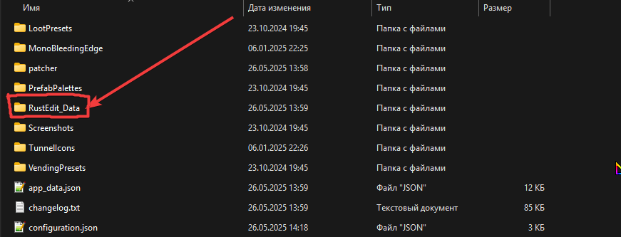
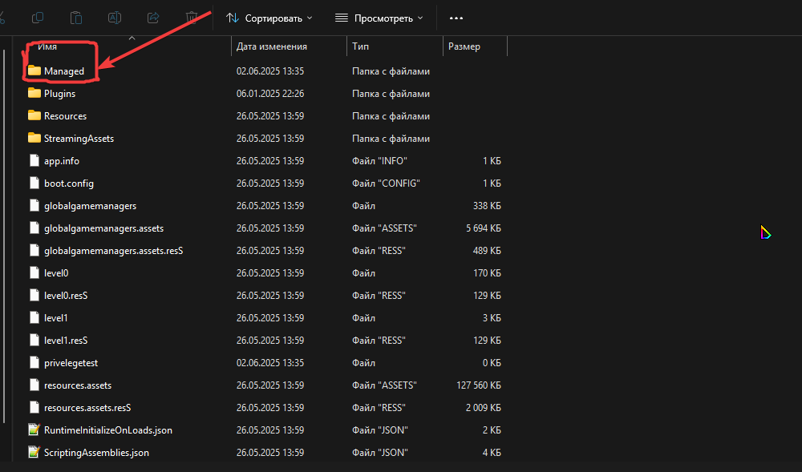

# RustEditProCrack

Автоматический патчер Unity-сборки, который удаляет ограничения и активирует PRO-функции.

## Возможности

- **PRO Режим**: Автоматически патчит обфусцированные булевы методы через `DiscordPresence.UpdateActivity`
- **Разблокировка Prefabs**: Удаляет проверку `File.Exists()` 
- **Удаление пароля**: Устраняет защиту паролем в `WorldSaveLoad`
- **Удаление блоков**: Патчит ограничения класса `NJFSINOIPNMDA`

## Установка и использование

### Требования

- .NET 6.0+
- Unity `Assembly-CSharp.dll`

### Шаг 1: Находим Assembly-CSharp.dll

1. Зайдите в папку, где установлен RustEdit
2. Найдите папку `rustedit_data`



3. В этой папке найдите папку `Managed` и скопируйте её в проект



### Шаг 2: Компиляция и запуск

1. Соберите проект командой:
   ```bash
   dotnet build
   ```

2. Запустите патчер с указанием пути к DLL:
   ```bash
   dotnet run -- "Managed/Assembly-CSharp.dll"
   ```

3. Получите патченный файл `Assembly-CSharp_Modifi.dll`

4. Переименуйте файл `Assembly-CSharp_Modifi.dll` обратно в `Assembly-CSharp.dll` и замените им оригинальный файл в папке `Managed` в установленной программе RustEdit

### Установка .NET с помощью dotnet-install.sh

Если у вас нет установленного .NET SDK, вы можете использовать включенный скрипт для его установки:

```bash
# Сделать скрипт исполняемым
chmod +x dotnet-install.sh

# Установить последнюю версию .NET SDK
./dotnet-install.sh

# После установки добавьте путь в PATH (если скрипт не сделал этого автоматически)
export PATH=$HOME/.dotnet:$PATH

# Проверка установки
dotnet --version
```

## Как это работает

1. Находит обфусцированный PRO-класс через строку "512_2" в `DiscordPresence.UpdateActivity`
2. Патчит булев метод, чтобы он всегда возвращал `true`
3. Удаляет проверку файлов и проверки паролей
4. Заменяет блокирующие инструкции на `NOP`

**Результат**: Полностью разблокированная сборка Unity со всеми удалёнными ограничениями. 